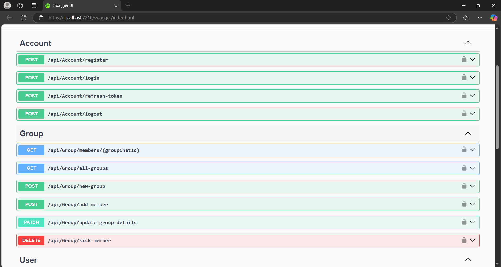
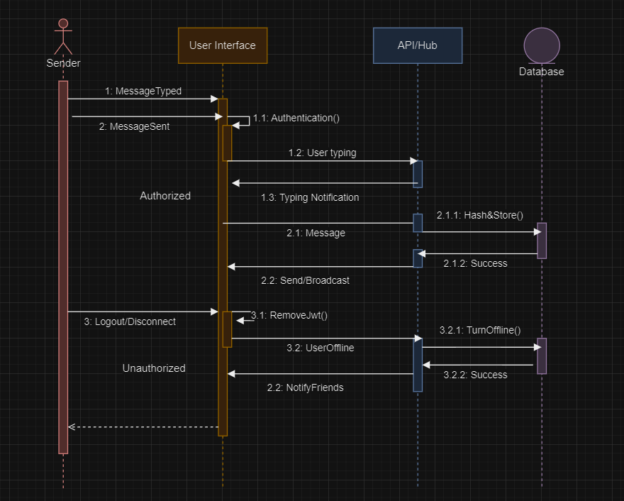

# ChitChat Backend

## Overview

This project is a real-time chat application back-end built with ASP.NET Core, using SignalR for real-time communication, MongoDB container for data storage, and JWT for secure authentication.

## Features

- **Real-Time Chat**: Enables instant communication between users with the help of SignalR WebSockets for real-time updates.
- **Authentication & Authorization**: Uses JWT (JSON Web Token) for user authentication/authorization. Refresh token mechanism is also included for longer sessions.
- **Storage**: Application data is stored in a Mongo NoSQL database container. Messages are hashed and stored for data integrity.
- **RESTful API**: Includes various RESTful endpoints for user management, group management, and other features. Built-in SwaggerUI provides API documentation. Repository patter is used to decouple the database interactions from business logic.

## Setting Up

### Prerequisites

- [.NET SDK](https://dotnet.microsoft.com/download)
- [Docker](https://www.docker.com/) (for running the MongoDb container)
- MongoDb image
  
### Installation

1. Clone the repository:

   ```bash
   git clone https://github.com/OzturkVedat/RealTimeChatApp_Backend.git
   cd RealTimeChatApp_Backend
   ```

2. Restore the .NET dependencies:

    ```bash
    dotnet restore
    ```

3. Build the project:

    ```bash
    dotnet build
    ```
    
4. Set up database:
   Build a Mongo container. Modify the connection string in appsettings.json. For our project, commands are:
    ```bash
    docker pull mongo
    docker run -d -p 27017:27017 --name mongodb -e MONGO_INITDB_ROOT_USERNAME=admin -e MONGO_INIT_ROOT_PASSWORD=password mongo
    ```
     
5. Run the API on Visual Studio, which will route you to SwaggerUI automatically. Alternatively, you can run the app via .NET CLI:

    ```bash
    dotnet run --project RealTimeChatApp.API
    ```
    
### Swagger UI



### UML Sequence Diagram




## Contributing
Feel free to open issues or submit pull requests for improvements, errors, etc.
